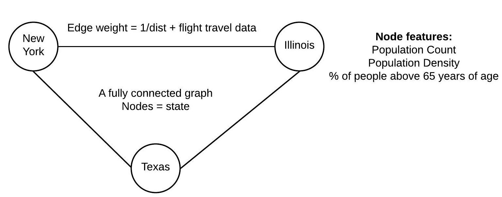

# Analyzing spread of COVID-19 using Graph Neural Networks 
The aim of this project is to provide users with an end-to-end pipeline for processing data related to COVID-19, create graph structure from that data and allow users to easily manage node features and edge weights. 

## Installation 
* Install pytorch from the [official site](https://pytorch.org/get-started/locally/)
* Install pytorch-geometric by executing the following: 
```
pip install torch-scatter==latest+${CUDA} -f https://pytorch-geometric.com/whl/torch-1.4.0.html
pip install torch-sparse==latest+${CUDA} -f https://pytorch-geometric.com/whl/torch-1.4.0.html
pip install torch-spline-conv==latest+${CUDA} -f https://pytorch-geometric.com/whl/torch-1.4.0.html
pip install torch-geometric
```
where ${CUDA} should be replaced by either cpu, cu92, cu100 or cu101 depending on your PyTorch installation.
* Run `pip install -r requirements.txt`
* Download basemap wheel package from [here](https://www.lfd.uci.edu/~gohlke/pythonlibs/#basemap)
* Go the the directory where wheel package is downloaded and pip install the package 

## Dataset 
The dataset folder can be downloaded [here.](https://drive.google.com/file/d/1ybNYM9-q524GCmXcr-PvlTVR_ye6B5-f/view?usp=sharing) Extract the .zip file in the root folder of repository. 

## File information 
* dataloader.py - This file can be used to load population data, flight data and form a dictionary of graph nodes. 
* data_preparation.py - This file is similar to dataloader.py but also handles timeseries data 
* graph_loader.py  - This file is used to create the actual graph object (pytorch geometric object). 
* model_architecture.py - Three GNN architectures are present here - Graph Convolution Network, SageConv, Message Passing. Users can additionally implement their own architectures in this file 
* corona.py - Can be used to create an inmemory dataset.
* visualizer.py/heatmap.py - These files can be used to visualize the graph and identify nodes of interest 

## Graph Structure 


### Node representation: 
The nodes in our graph are represented as “places”. These places can be of different granularity – i.e, a town, a province, a state. The user can decide the granularity which they want. In our implementation, we chose a node to be a state as it was easy to find state level information on the internet; allowing us to create rich node features. The node features which we have selected are as follows: 
* **For non-timeseries data**: Population Count, Population Density, Percentage of people above the age of 65. Total features = 3. (Features are normalized) 
* **For timeseries data:** Number of infected people in the past 14 days + population count, population density and % of people above 65 years of age. Total features = 17. (Features are normalized) 

### Node labels: 
The node labels or the node output is the number of infected people in that state. 
### Edge representation: 
We assume a fully connected graph structure. That is, each node will be connected to every other node. Hence, there will be a total of n*(n-1)/2  edges. 
Every edge is weighted based on two parameters: Inverse of distance + Flight count between the nodes of the two edges. We calculate the distance by calculating the geodesic distance between the states using the latitude and longitude co-ordinates of the state. 
Hence, nodes (states) which are closer by will have a higher inverse distance value and nodes with more flights going to and fro between them will have a higher value. This way, we get large edge weight values for related nodes (states). Additionally, we provide a filter function which can delete edges based on a threshold value (i.e., if edge weight < threshold, delete the edge). 
In brief, a graph neural network algorithm will try to make use of information of a node’s neighboring states and use that to predict the number of infected people for that given node (state). For the sake of simplicity during demonstration we have only considered data from USA. So, the graph structure is one in which the nodes are states of USA. 


## Usage 
Make modifications to the files mentioned in the previous section and then run train.py 


